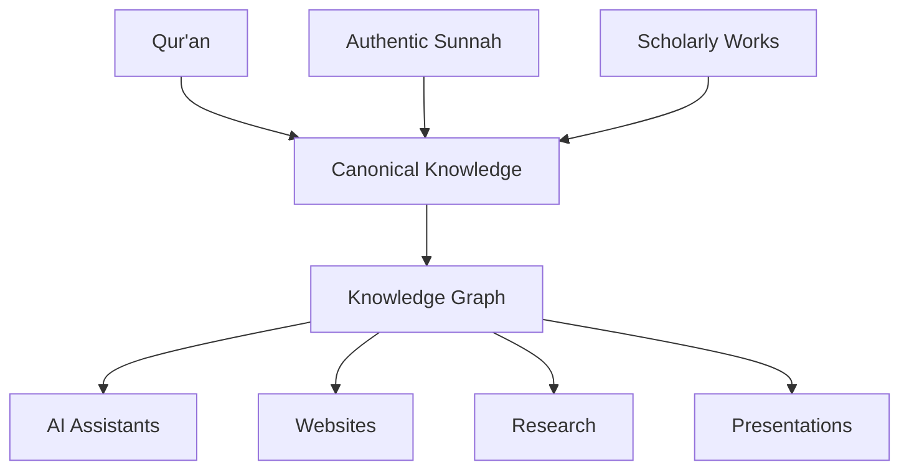

# Noor — Islamic Knowledge Infrastructure

Noor is an open, non-profit initiative to build a structured, version-controlled knowledge infrastructure for authentic Islamic knowledge.

**Working Draft • Version 0.1**
> An open specification for preserving, organizing, and connecting authentic Islamic knowledge.

Rather than creating new Islamic knowledge, Noor seeks to preserve, organize, connect, and make existing knowledge more accessible while ensuring every conclusion remains traceable to its evidences in the Qur'an and authentic Sunnah.

The project is built on a simple principle:

> **Knowledge is the product. Everything else is an interface.**

## The Problem

Islamic knowledge is one of humanity's richest intellectual traditions.

However, it is distributed across books, hadith collections, tafsir, research papers, websites, lectures, and personal notes.

While these resources are valuable, they remain largely disconnected in the digital world.

Noor aims to provide a structured knowledge infrastructure that connects them while preserving complete traceability to their original evidences.

## Core Principles

- Knowledge is written once.
- Everything remains traceable.
- Revelation remains the highest authority.
- Presentation never changes knowledge.
- Everything is version-controlled.
- Everything is connected.
- Technology serves knowledge.

## Documentation

- Project Vision
- Architecture
- Specifications
- Methodology
- Architecture Decision Records
- Examples
- Roadmap

## Roadmap

- [x] Define project vision
- [x] Establish philosophy
- [ ] Define authority model
- [ ] Define entity model
- [ ] Define metadata specification
- [ ] Define knowledge graph
- [ ] Implement canonical repository

      
## Long-Term Vision

Noor aims to become an open specification and reference implementation for structured Islamic knowledge that can power:

- AI assistants
- Websites
- Educational platforms
- Research tools
- Mobile applications
- Search engines
- Future technologies

## Contributing

The project is currently in the architecture and specification phase.

Contributions are welcome through discussions, issues, and pull requests that align with the project's methodology.

## License

License information will be added during the first public release.

## Current Status

🚧 **This repository is an active working draft.**

The current focus is on:

* Defining the knowledge architecture
* Designing entities and relationships
* Establishing canonical data structures
* Developing metadata and citation standards
* Building a scalable knowledge graph
* Documenting the methodology before implementation

Implementation of the knowledge base will begin after the foundational specifications are complete.
